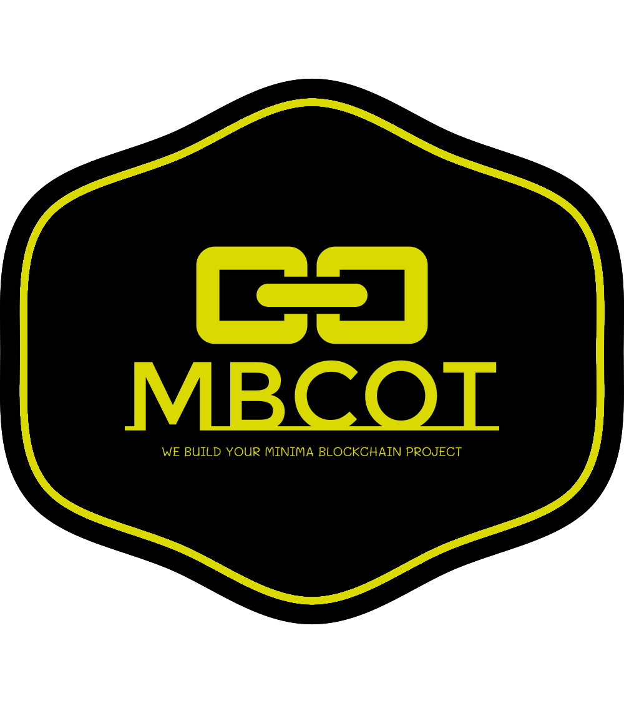

# Ticket  
**Ticketing system to avoid fraud and over saturation and proof authentiticy**

  
-  On concerts, events, meeting, football competitions, race competitions..... people have to get their
tickets usually online and most of times on a high demand the system got collapsed or the tickets
once printed they got falsification.
-  A ticketing system Dapp over minima will avoid most of those problems, the organization of the
events would buy a specific number of NFT's configured according their needs and with his
publicity chosen embedded on the NFT, so the user would only had to install the DAPP (One dapp
for all systems) , choose the competition or the concert or whatever tickets they want to buy, and
once payed the NFT's tickets, they are sent to the wallet's user.
-  On the event day, only the people who got the NFT on his wallet can access to the event and avoid
fraud and the over saturation when some kind of event is high demaneded by a lot of people.
